# DevSecOps Capstone Project on GKE


A comprehensive **End-to-End DevSecOps pipeline** deployed on Google Kubernetes Engine (GKE), demonstrating **Shift Left** security principles throughout the software development lifecycle.

---

## 📊 Visual Architecture

### High-Level System Architecture

```mermaid
flowchart TB
    subgraph Developer["👨‍💻 Developer Workflow"]
        DEV[Developer] -->|Push Code| GH[GitHub Repository]
    end

    subgraph CICD["🔄 CI/CD Pipeline - GitHub Actions"]
        GH -->|Trigger| CHECKOUT[Code Checkout]
        CHECKOUT --> TEST[Unit Tests<br/>JUnit 5]
        TEST --> SAST[SAST Scan<br/>Snyk]
        SAST --> BUILD[Maven Build]
        BUILD --> DOCKER[Docker Build<br/>Multi-stage]
        DOCKER --> TRIVY[Container Scan<br/>Trivy]
        TRIVY --> PUSH[Push to<br/>Docker Hub]
    end

    subgraph GCP["☁️ Google Cloud Platform"]
        subgraph VPC["🔒 Custom VPC"]
            subgraph GKE["⎈ GKE Cluster"]
                ARGOCD[ArgoCD<br/>GitOps]
                APP[Java App<br/>Pods]
                LB[LoadBalancer<br/>Service]
            end
        end
        PROM[Prometheus] --> GRAF[Grafana]
    end

    subgraph Security["🔐 Runtime Security"]
        ZAP[OWASP ZAP<br/>DAST Scan]
    end

    PUSH -->|Pull Image| ARGOCD
    ARGOCD -->|Deploy| APP
    APP --> LB
    LB -->|Expose| ZAP

    classDef gcpStyle fill:#4285F4,color:white,stroke:#333
    classDef secStyle fill:#FF6B6B,color:white,stroke:#333
    classDef cicdStyle fill:#2088FF,color:white,stroke:#333

    class GKE,VPC gcpStyle
    class SAST,TRIVY,ZAP secStyle
    class CHECKOUT,TEST,BUILD,DOCKER,PUSH cicdStyle
```



---

### CI/CD Pipeline Flow


---

### Security Scanning Stages

```mermaid
graph TD
    subgraph ShiftLeft["⬅️ Shift-Left Security"]
        DEPS[Dependencies] --> SNYK[Snyk SAST<br/>Vulnerability Scan]
        SNYK -->|High Severity| REPORT1[Security Report]
    end

    subgraph Container["📦 Container Security"]
        IMG[Docker Image] --> TRIVY[Trivy Scanner]
        TRIVY -->|OS & Library CVEs| REPORT2[Vulnerability Report]
    end

    subgraph Runtime["🏃 Runtime Security"]
        WEBAPP[Running App] --> ZAP[OWASP ZAP]
        ZAP -->|Dynamic Analysis| REPORT3[DAST Report]
    end

    REPORT1 --> DECISION{Pass?}
    REPORT2 --> DECISION
    REPORT3 --> DECISION
    DECISION -->|Yes| DEPLOY[✅ Verified Deployment]
    DECISION -->|No| FIX[🔧 Fix & Retry]

    style SNYK fill:#4C4A73,color:white
    style TRIVY fill:#1904DA,color:white
    style ZAP fill:#000000,color:white
```



---

### GCP Infrastructure (Terraform)


---

## 📁 Project Structure

```
gke-devsecops-project/
├── app-code/                    # Java Spring Boot application
│   ├── src/                     # Application source code
│   │   ├── main/java/           # REST controllers, main app
│   │   └── test/java/           # Unit tests (JUnit 5)
│   ├── pom.xml                  # Maven dependencies
│   └── Dockerfile               # Multi-stage build definition
├── terraform/                   # Infrastructure as Code
│   ├── providers.tf             # GCP provider + GCS backend
│   ├── variables.tf             # Input variables
│   ├── vpc.tf                   # VPC & Subnet with secondary ranges
│   └── gke.tf                   # GKE cluster & node pool
├── k8s-manifests/               # Kubernetes manifests (ArgoCD source)
│   ├── deployment.yaml          # Deployment with health probes
│   └── service.yaml             # LoadBalancer service
├── .github/workflows/           # CI/CD pipeline
│   └── ci-pipeline.yml          # GitHub Actions workflow
├── reports/                     # Security scan reports
│   ├── gen.conf                 # OWASP ZAP configuration
│   └── testreport.html          # ZAP scan results
└── screenshots/                 # Documentation images
```

---

## 🎯 Features Implemented

### Application Layer

| Feature              | Implementation    | Details                          |
| -------------------- | ----------------- | -------------------------------- |
| **REST API**         | Spring Boot 3.2   | Java 17, `/` endpoint            |
| **Health Endpoints** | Spring Actuator   | `/actuator/health` for probes    |
| **Unit Testing**     | JUnit 5 + MockMvc | Controller tests with assertions |
| **Build Tool**       | Maven 3.9         | Dependency management, packaging |

### Container Security

| Feature               | Implementation                | Details                                  |
| --------------------- | ----------------------------- | ---------------------------------------- |
| **Multi-stage Build** | Dockerfile                    | Smaller image, no build tools in runtime |
| **Alpine Base**       | eclipse-temurin:17-jre-alpine | Minimal attack surface                   |
| **Non-root User**     | `adduser/USER directive`      | Principle of least privilege             |

### Infrastructure as Code

| Resource         | Configuration          | Details                       |
| ---------------- | ---------------------- | ----------------------------- |
| **VPC**          | Custom network         | No auto-created subnets       |
| **Subnet**       | 10.0.0.0/24            | With secondary ranges for GKE |
| **GKE Cluster**  | Zonal (europe-west3-b) | 2x e2-medium nodes            |
| **Remote State** | GCS Backend            | `tf-state-gke-devops-project` |

### Kubernetes Deployment

| Feature             | Implementation | Details                       |
| ------------------- | -------------- | ----------------------------- |
| **Deployment**      | 1 replica      | Resource limits: 512Mi/500m   |
| **Liveness Probe**  | HTTP GET       | `/actuator/health`, 60s delay |
| **Readiness Probe** | HTTP GET       | `/actuator/health`, 40s delay |
| **Service**         | LoadBalancer   | Port 80 → 8080                |

### CI/CD Pipeline

| Stage              | Tool                  | Function                   |
| ------------------ | --------------------- | -------------------------- |
| **Checkout**       | actions/checkout@v4   | Clone repository           |
| **Java Setup**     | actions/setup-java@v4 | JDK 17 Temurin             |
| **Unit Tests**     | Maven                 | `mvn test`                 |
| **SAST**           | Snyk                  | Dependency vulnerabilities |
| **Build**          | Maven                 | `mvn clean package`        |
| **Docker Build**   | Docker                | Multi-stage image          |
| **Container Scan** | Trivy                 | CVE detection              |
| **Push**           | Docker Hub            | With version + latest tags |

### GitOps & Monitoring

| Component      | Tool       | Purpose                                  |
| -------------- | ---------- | ---------------------------------------- |
| **GitOps**     | ArgoCD     | Continuous deployment from k8s-manifests |
| **Metrics**    | Prometheus | Cluster and app metrics                  |
| **Dashboards** | Grafana    | Visualization                            |
| **DAST**       | OWASP ZAP  | Runtime security testing                 |

---

## ✅ Prerequisites

| Tool           | Version | Purpose                                |
| -------------- | ------- | -------------------------------------- |
| **Terraform**  | >= 1.0  | Infrastructure provisioning            |
| **kubectl**    | >= 1.25 | Kubernetes cluster management          |
| **gcloud CLI** | Latest  | GCP authentication & configuration     |
| **Docker**     | >= 20.0 | Local container builds (optional)      |
| **Helm**       | >= 3.0  | Installing ArgoCD, Prometheus, Grafana |

**GCP Requirements:**

- Active GCP project with billing enabled
- APIs enabled: Compute Engine, Kubernetes Engine, Container Registry
- Service account with appropriate IAM roles

---

## 🚀 Step-by-Step Deployment Guide

### 1. Infrastructure Provisioning (Terraform)

```bash
# Navigate to the Terraform directory
cd terraform/

# Initialize Terraform
terraform init

# Preview the infrastructure changes
terraform plan

# Apply the configuration
terraform apply -auto-approve
```

**Resources Created:**

- Custom VPC and Subnet
- Zonal GKE Cluster (optimized for GCP quotas)
- Custom Node Pool with 2x `e2-medium` instances

### 2. Configure kubectl Access

```bash
# Authenticate with GKE cluster
gcloud container clusters get-credentials <CLUSTER_NAME> \
    --zone <ZONE> \
    --project <PROJECT_ID>

# Verify cluster access
kubectl get nodes
```

### 3. CI Pipeline Execution

The pipeline triggers automatically on push to `main` branch when changes are made to:

- `app-code/**`
- `.github/workflows/**`

**Required GitHub Secrets:**
| Secret | Description |
|--------|-------------|
| `DOCKER_USERNAME` | Docker Hub username |
| `DOCKER_PASSWORD` | Docker Hub access token |
| `SNYK_TOKEN` | Snyk API token for SAST |

### 4. ArgoCD Setup & Access

```bash
# Create ArgoCD namespace
kubectl create namespace argocd

# Install ArgoCD
kubectl apply -n argocd -f https://raw.githubusercontent.com/argoproj/argo-cd/stable/manifests/install.yaml

# Wait for pods to be ready
kubectl wait --for=condition=Ready pods --all -n argocd --timeout=300s

# Expose ArgoCD Server (option 1: LoadBalancer)
kubectl patch svc argocd-server -n argocd -p '{"spec": {"type": "LoadBalancer"}}'

# Get ArgoCD external IP
kubectl get svc argocd-server -n argocd

# Get initial admin password
kubectl -n argocd get secret argocd-initial-admin-secret \
    -o jsonpath="{.data.password}" | base64 -d && echo
```

**Login:** Navigate to the external IP, use `admin` and the retrieved password.

### 5. Monitoring Stack (Prometheus & Grafana)

```bash
# Add Helm repositories
helm repo add prometheus-community https://prometheus-community.github.io/helm-charts
helm repo update

# Install kube-prometheus-stack
helm install monitoring prometheus-community/kube-prometheus-stack \
    --namespace monitoring \
    --create-namespace

# Access Grafana (port-forward)
kubectl port-forward svc/monitoring-grafana -n monitoring 3000:80
```

**Grafana Credentials:**

- **Username:** `admin`
- **Password:** `prom-operator`

---

## 🔐 Security Measures

This project implements security at every stage of the pipeline:

| Stage              | Tool                                                                                             | Purpose                           |
| ------------------ | ------------------------------------------------------------------------------------------------ | --------------------------------- |
| **SAST**           |            | Dependency vulnerability scanning |
| **Container Scan** |  | Image vulnerability detection     |
| **DAST**           |     | Runtime security testing          |
| **Container**      | Non-root user                                                                                    | Reduced attack surface            |
| **Image**          | Alpine-based                                                                                     | Minimal footprint, fewer CVEs     |

### Security Best Practices Implemented:

- ✅ Multi-stage Docker builds for minimal image size
- ✅ Non-root user execution in containers
- ✅ Health checks (liveness & readiness probes)
- ✅ Resource limits to prevent DoS
- ✅ Shift-left security with pre-deployment scanning
- ✅ Post-deployment DAST validation

---

## 📸 Screenshots

### CI Pipeline Success


---

### ArgoCD Application Sync


---

### Grafana Dashboard


---

### OWASP ZAP Security Report


---

## 🧹 Cleanup

To destroy all infrastructure and avoid ongoing charges:

```bash
# Delete Kubernetes resources
kubectl delete -f k8s-manifests/

# Destroy Terraform infrastructure
cd terraform/
terraform destroy -auto-approve
```

---

## 📄 License

This project is licensed under the MIT License.

---

## 👤 Author

**DevOps Engineer** - Capstone Project Demonstration

---

> **Note:** Remember to replace placeholder values (e.g., `<CLUSTER_NAME>`, `<ZONE>`, `<PROJECT_ID>`) with your actual configuration values.
